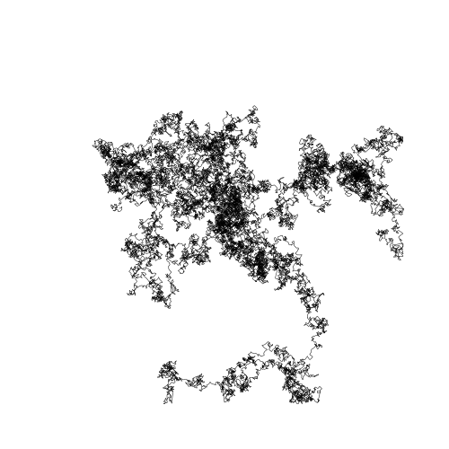

# Basquiat

Small Python library for creative coding in Python.

## Using

```
python3 -m venv venv
source venv/bin/activate
pip install --upgrade pip
pip install -r requirements.txt

# Random walk example
python rw.py
```

## Studies

### Random walk


