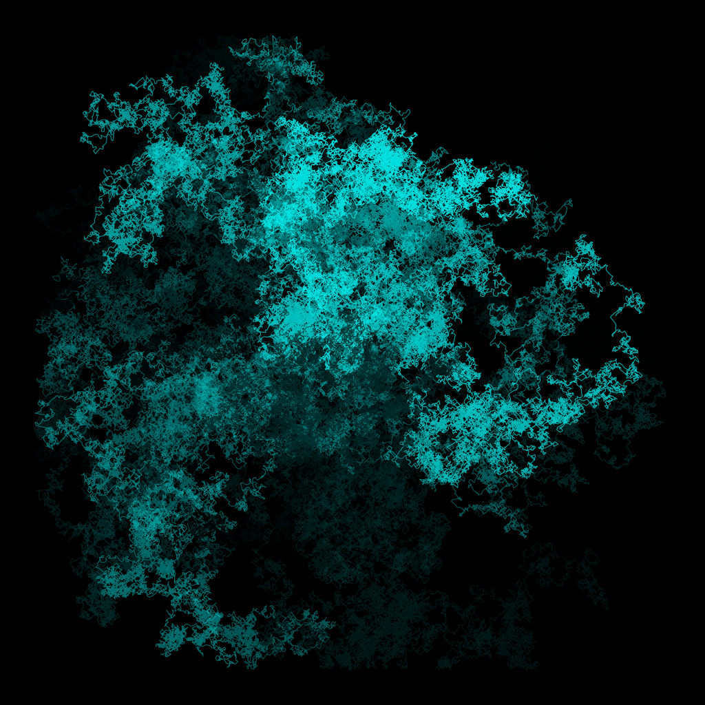
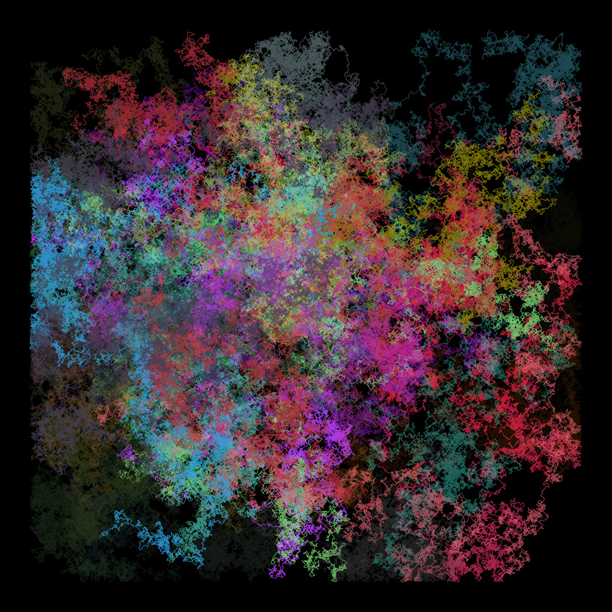
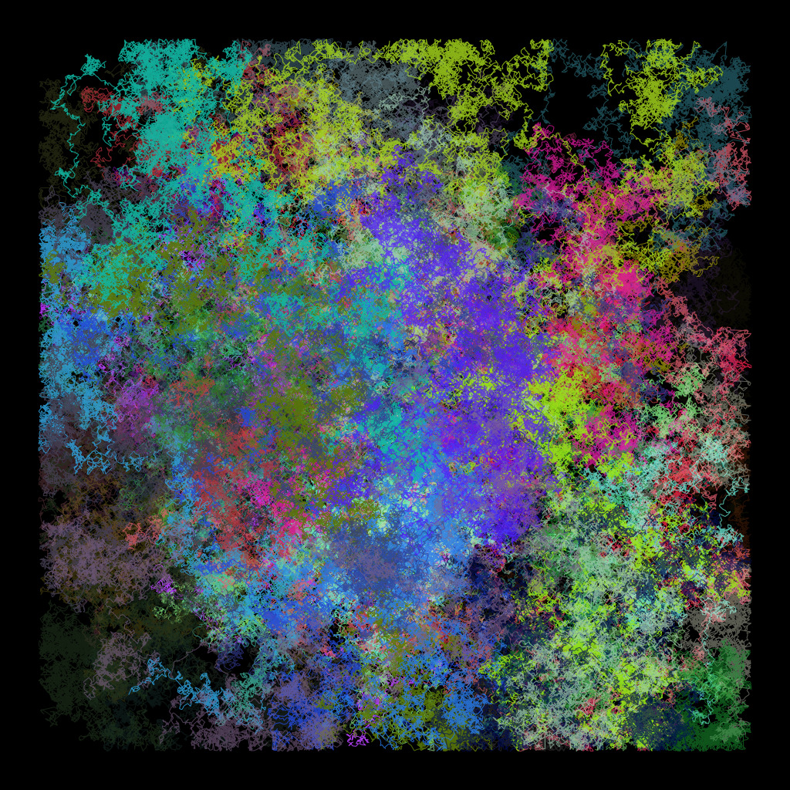
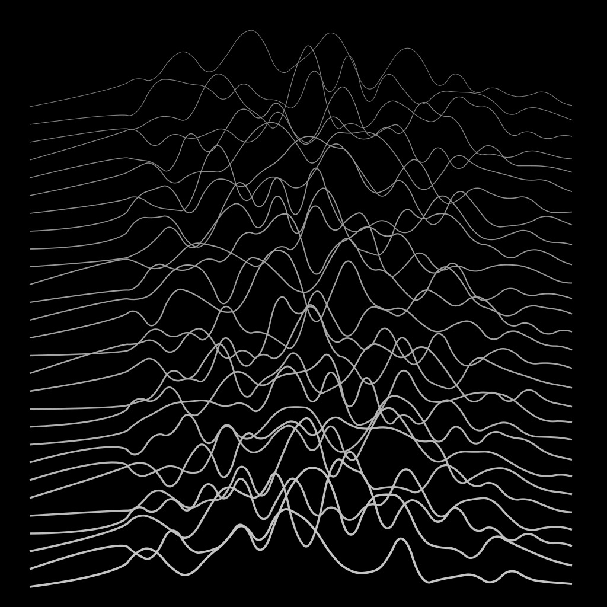
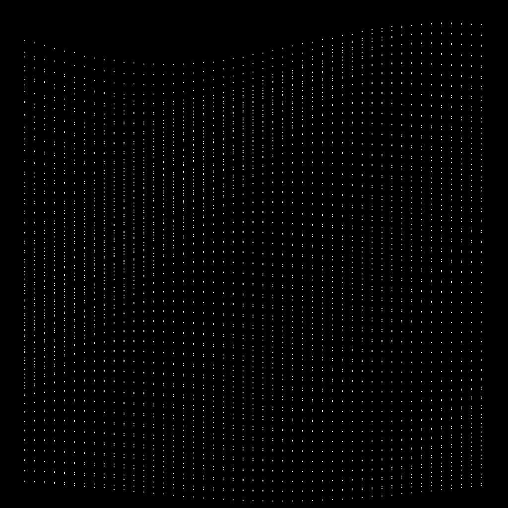
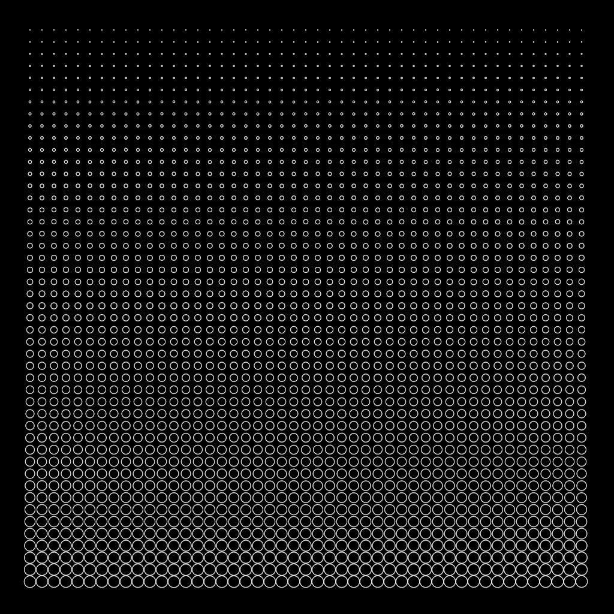
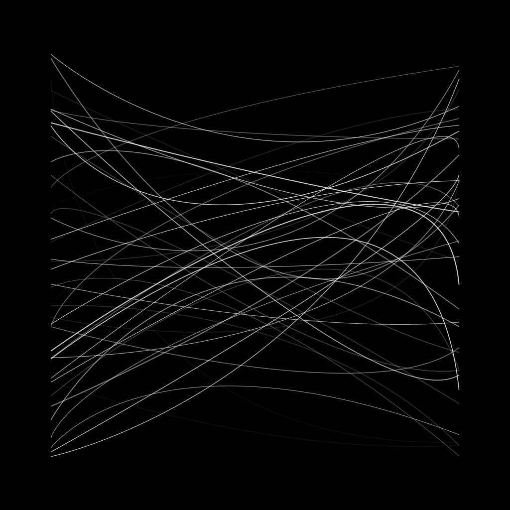

# Basquiat



Small Mojo :fire: and Python library for creative coding powered by
[Cairo](https://www.cairographics.org/) (through [pycairo](https://pycairo.readthedocs.io/en/latest/)).
The name is a humble homage to the artist [Jean-Michel Basquiat](https://en.wikipedia.org/wiki/Jean-Michel_Basquiat).

Both Mojo and Python implementations depend on `pycairo`. I'm planning to migrate
to cffi `libcairo` directly from Mojo when possible, but we already have the
Mojo implementation running almost 3x faster than Python:

```
% time mojo rw.mojo
mojo rw.mojo  3.14s user 0.09s system 92% cpu 3.493 total
% time python rw.py
python rw.py  8.69s user 0.15s system 126% cpu 6.990 total
```

*Note:* only a few drawing primitives are exposed from Cairo right now, but
more to come pretty soon!

## Setup

For the Python version, create a virtual env and install the requirements.

```
python3 -m venv venv
source venv/bin/activate
pip install --upgrade pip
pip install -r requirements.txt
```

For the Mojo version, please follow the instructions on Modular's website
to get Mojo up and running. Make sure you have `pycairo` installed as well.

## Using

Basquiat keeps the same API between Python and Mojo. The idea is to
expose a simple `Renderer` object that keeps the state of the canvas
and implements drawing operations.

In Python:

```python
from basquiat.render import Renderer

r = Renderer(1024, 1024)
r.line(0, 512, 512, 512)
r.stroke()
```

In Mojo:

```python
from basquiat.render import Renderer

let r = Renderer(1024, 1024)
r.line(0, 512, 512, 512)
r.stroke()
```

Please check the examples (`rw.{mojo,py}`, `lines.{mojo,py}`) and
also the Mojo and Python implementations in `basquiat/`.

## Studies

### Random walk

A couple of random walkers with 100k steps.




### Lines

Inspired by Joy Division's [Unknown Pleasure](https://en.wikipedia.org/wiki/Unknown_Pleasures) album cover.



### Noise

Some experiments with uniform and Perlin noise.




